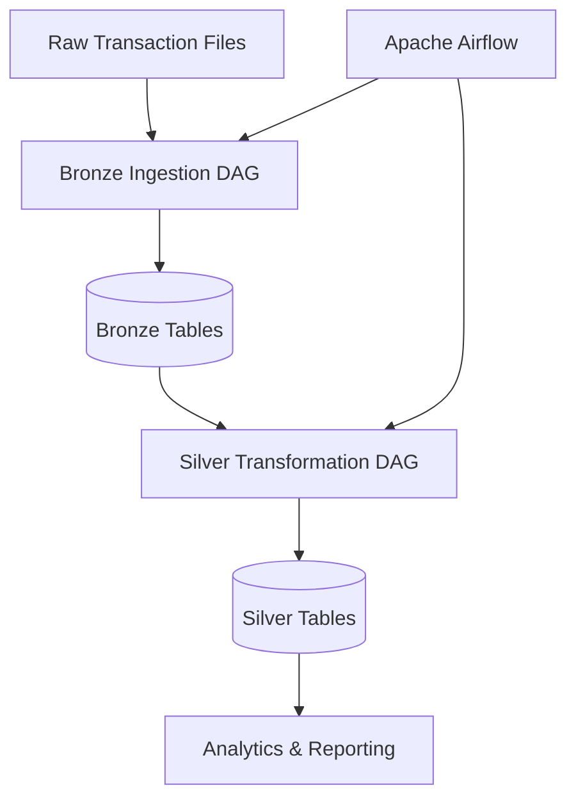

# Mercury Data Platform 

A data engineering project that implements a Medallion Architecture (Bronze → Silver) pipeline for banking transaction data using Apache Airflow, PostgreSQL, Docker, and Python.

The platform ingests raw transaction files, stores them in a Bronze layer, applies cleaning and transformation logic, and produces analytics-ready datasets in a Silver layer.

---

## Project Goals

This project demonstrates:

* Data ingestion pipelines
* Apache Airflow orchestration
* PostgreSQL data warehousing
* Medallion Architecture design
* Dockerized data platforms
* ETL / ELT workflows
* Data transformation and validation

---

## Architecture

### Data Flow

1. Raw transaction files are placed in `data/raw/`
2. Airflow triggers the Bronze ingestion pipeline
3. Raw records are loaded into PostgreSQL Bronze tables
4. Transformation jobs clean and normalize records
5. Processed records are stored in Silver tables
6. Clean data becomes available for analytics and reporting

### System Architecture



---

## Technology Stack

| Category               | Technology              |
| ---------------------- | ----------------------- |
| Language               | Python 3.13             |
| Workflow Orchestration | Apache Airflow          |
| Database               | PostgreSQL              |
| Containerization       | Docker & Docker Compose |
| Dependency Management  | uv                      |
| Logging                | structlog               |

---

## Repository Structure

```text
mercury-data-platform/
├── dags/
│   ├── bronze_ingestion_dag.py
│   └── silver_processing_dag.py
│
├── ingestors/
│   ├── file_ingestor.py
│   └── postgres_ingestor.py
│
├── transformers/
│   └── transaction_transformer.py
│
├── scripts/
│   ├── init_bronze.sql
│   └── init_silver.sql
│
├── data/
│   └── raw/
│       └── transactions_v1.csv
│
├── main.py
├── docker-compose.yml
├── pyproject.toml
└── README.md
```

---

## Example Pipeline

### Input (Raw Transaction)

| transaction_id | merchant  | amount |
| -------------- | --------- | ------ |
| TX001          | Starbucks | 12.50  |
| TX002          | Amazon    | 120.00 |

### Output (Silver Layer)

| transaction_id | merchant  | amount | is_risk_flagged |
| -------------- | --------- | ------ | --------------- |
| TX001          | Starbucks | 12.50  | false           |
| TX002          | Amazon    | 120.00 | false           |

---

## Prerequisites

* Python 3.13+
* Docker
* Docker Compose
* uv

---

## Quick Start

### Clone Repository

```bash
git clone https://github.com/yourusername/mercury-data-platform.git
cd mercury-data-platform
```

### Configure Environment

Create a `.env` file:

```env
DB_HOST=postgres
DB_PORT=5432
DB_NAME=banking_db
DB_USER=user
DB_PASS=password
PLATFORM_HOME=/opt/airflow
```

### Start Infrastructure

```bash
docker compose up -d
```

### Verify Running Containers

```bash
docker ps
```

### Access Airflow

```text
URL: http://localhost:8081
Username: admin
Password: admin
```

---

## Running the Pipeline

Execute the pipeline manually:

```bash
docker exec -it mercury-airflow-webserver python /opt/airflow/main.py
```

---

## Database Verification

Verify transformed records:

```bash
docker exec -it mercury-postgres \
psql -U user -d banking_db \
-c "SELECT * FROM silver_transactions LIMIT 10;"
```

---

## Skills Demonstrated

* Data Engineering
* Apache Airflow
* PostgreSQL
* Docker
* ETL / ELT Design
* Data Modeling
* SQL
* Python
* Medallion Architecture
* Workflow Orchestration

---

## Project Status

### Completed

* [x] Bronze ingestion pipeline
* [x] Silver transformation pipeline
* [x] PostgreSQL integration
* [x] Airflow orchestration
* [x] Dockerized deployment

### Planned

* [ ] Gold analytics layer
* [ ] Data quality validation
* [ ] Great Expectations integration
* [ ] dbt transformations
* [ ] Kafka streaming ingestion
* [ ] CI/CD with GitHub Actions
* [ ] Data lineage tracking

---
