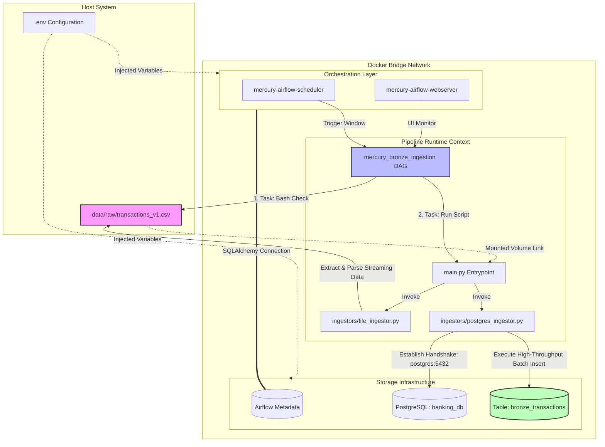

# Mercury Data Platform

A production-grade data engineering platform for banking transaction ingestion, built with Python 3.13, Docker, and Airflow.

## ## 1. Prerequisites
* **Python**: 3.13+
* **Package Manager**: [uv](https://docs.astral.sh/uv/)
* **Containerization**: Docker and Docker Compose

## ## 2. Setup

### Step 1: Environment Configuration
Create a `.env` file in the root directory and add the following (matching your `.gitignore` rules):
```env
DB_HOST=localhost
DB_PORT=5434
DB_NAME=banking_db
DB_USER=your_user
DB_PASS=your_password
```

## Data Platform Architecture

The following diagram illustrates our automated multi-service batch ingestion architecture running across container and host filesystem boundaries:

